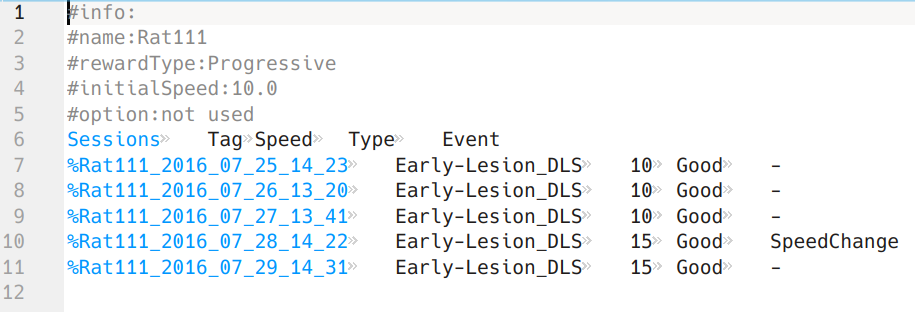

# AnimalProfile

A python package for tagging animal experiments.

This package creates and manages `profile` files for each animal, to keep track of experiments and assisst in grouping similar conditions together.
Here is an example:

A similar file for each animal consists of:
- __header__ parameters, which are labels for each animal.
such as its genetic background, its initial training method, etc.
In this example, 3 parameters are define:.
`rewardType`, `initialSpeed`, and `option`.
The `name` field is added automatically
- __body__, seperated from header by lack of a starting `#` character, consists of at least a `Sessions` column and a `Tag` column (added automatically).
The `Sessions` columns lists all the experiments, the `Tag` column should include a descriptive and unique label for the experimental condition (e.g., `Early-Lesion-DLS`).
User can add more columns to the body (3 more columns in this example).

The package:
- detects new experiments, adds them to the `profile` file (assuming the same experimental condition as the last session).
- provides simple interface for reading the profiles and grouping similar experiments for furthur analysis.

# Data structure

# Basic usage

# Installation