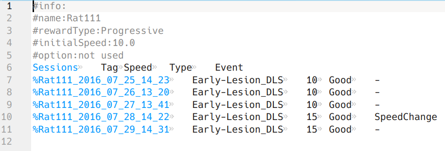

# AnimalProfile

A python package for tagging animal experiments.

This package creates and manages _profile_ files for each animal, to keep track of experiments and allow grouping similar conditions together.
Here is an example of a _profile_ file:

A similar file for each animal is created which consists of:
- __header__ parameters, which are labels for each animal.
such as its genetic background, its initial training method, etc.
In this example, 3 parameters are defined:
> "rewardType", "initialSpeed", and "option".
The "name" field is added automatically.
- __body__, seperated from the header by lack of a leading `#` character, consists of at least a _Sessions_ column and a _Tag_ column (added automatically).
The `_Sessions_ columns lists all the experiments, the _Tag_ column should include a descriptive and unique label for the experimental condition (e.g., _Early-Lesion-DLS_).
User can add more columns to the body (3 more columns in this example).

This package:
- detects new experiments, adds them to the `profile` file.
- provides an interface for reading the profiles and grouping similar experiments for furthur analysis.

# Data structure

Data must be structured in a [particular format](/Docs/dataStructure.md).

# Basic usage

Instructions are [here](/doc/instructions.md).

# Installation

## Requirements